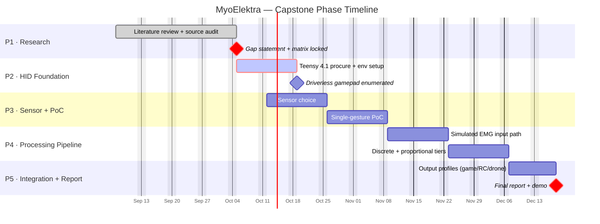

# MyoElektra

```mermaid
%%{init: {"gantt": {
  "useWidth": 1180,
  "leftPadding": 230,
  "barHeight": 26,
  "barGap": 8,
  "sectionFontSize": 14,
  "fontSize": 12,
  "gridColor": "#c9c9c9",
  "todayLineColor": "#e63946",
  "sectionBkgColor": ["#f2f4f8", "#ffffff"],
  "altBkgColor": ["#fafbfd", "#f2f4f8"],
  "taskTextColor": "#111111",
  "sectionBkgColorTransparency": false
}}}%%
gantt
    title MyoElektra — Capstone Phase Timeline
    dateFormat  YYYY-MM-DD
    axisFormat  %b %d
    tickInterval 1week
    excludes    weekends

    section P1 · Research
    Literature review + source audit  :done,      p1, 2026-09-07, 2026-10-05
    Gap statement + matrix locked     :milestone, crit, m1, 2026-10-05, 0d

    section P2 · HID Foundation
    Teensy 4.1 procure + env setup   :active,    crit, p2, 2026-10-05, 2026-10-19
    Driverless gamepad enumerated    :milestone, m2, 2026-10-19, 0d

    section P3 · Sensor + PoC
    Sensor choice: Olimex vs MyoWare :           p3a, 2026-10-12, 2026-10-26
    Single-gesture PoC               :           p3b, 2026-10-26, 2026-11-09

    section P4 · Processing Pipeline
    Simulated EMG input path         :           p4a, 2026-11-09, 2026-11-23
    Discrete + proportional tiers   :           p4b, 2026-11-23, 2026-12-07

    section P5 · Integration + Report
    Output profiles (game/RC/drone) :           p5a, 2026-12-07, 2026-12-18
    Final report + demo              :milestone, crit, m3, 2026-12-18, 0d
```
