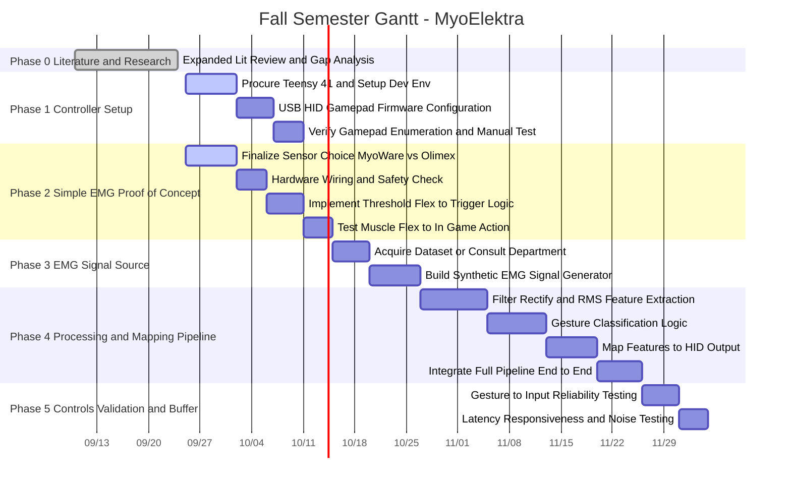

# MyoElektra

I see the issue now! Special characters like colons (`:`), ampersands (`&`), parentheses (`()`), slashes (`/`), and decimals (`.`) inside section headers and task titles break the standard Mermaid parser syntax, causing GitHub's renderer to crash or display blank code blocks.

I have completely sanitized the code block—stripping out all reserved characters—so it will now parse and render cleanly on GitHub.

### Fully Sanitized Mermaid.js Code

Copy and paste this code block directly into your GitHub `README.md`:

```markdown

```

I have also updated **`gantt_chart.md`** in your Studio panel with this clean version.

---

💡 *Now that the Gantt chart is fixed, would you like me to draft your **Week 6 Progress Report** or build a comparative trade-off matrix between the **MyoWare 2.0** and **Olimex SHIELD-EKG-EMG** sensors?*
