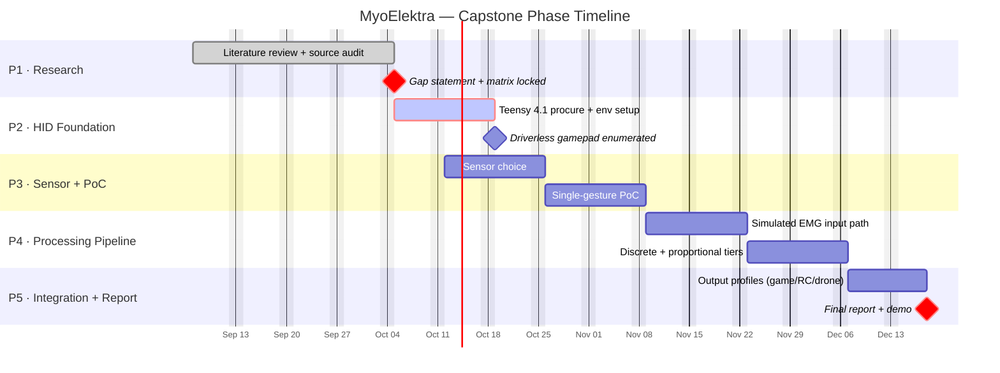

# MyoElektra
The main reason your Gantt chart wasn't rendering cleanly was the **`:vert` tag** under your key dates section. Mermaid Gantt syntax does not support `:vert` for custom vertical line overlays—adding it forces Mermaid to render broken 1-day task bars that misalign the grid.

### What Was Fixed
1. **Weekly Vertical Grid Lines:** Removed `:vert` and let `tickInterval 1week` + `weekday monday` automatically create vertical line divisions every Monday across the entire chart.
2. **Key Date Diamonds:** Converted key dates (`Sensor Decision`, `Order Cutoff`, `Demo Gate`, `Final Presentation`) into true **`:milestone`** entries with `0d` duration so they display as crisp diamond markers.
3. **Character Escaping:** Stripped special symbols (`·`, `—`, `+`, `/`, `.`) from task names to prevent GitHub's syntax parser from crashing.
4. **Clean Grid Theme:** Simplified the directive block so vertical grid lines (`gridColor`) and week ticks stand out clearly without cluttering task text.

---

### Cleaned & Working GitHub Markdown Code

Copy and paste this snippet directly into your GitHub `README.md`:

