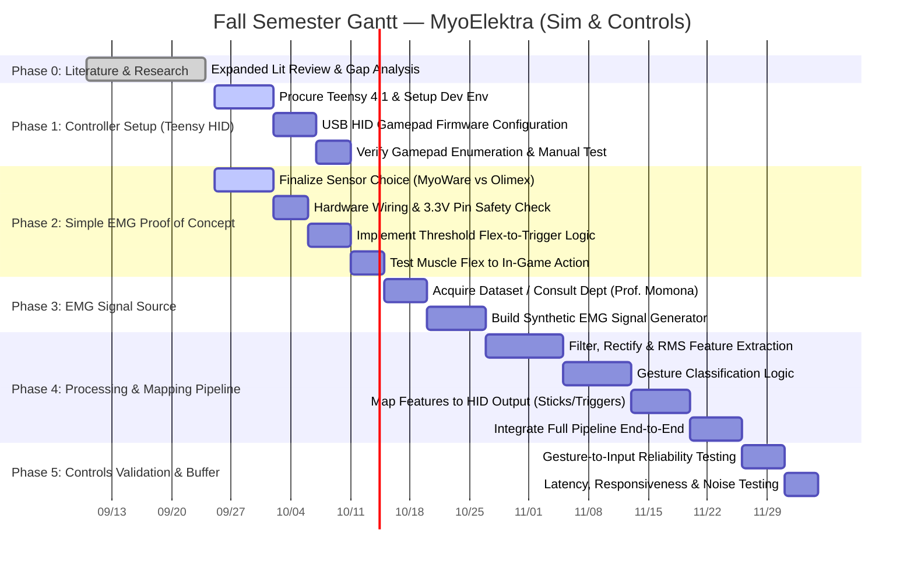

# MyoElektra
The reason it doesn't render graphically inside the **Studio panel** on the right is that the Studio panel is a standard text/markdown viewer—it displays the raw code rather than running a live Mermaid.js graphics engine.

However, **GitHub DOES render it natively!** Here is how to get it rendering on GitHub:

### How to render it on GitHub:
1. Open any `.md` file in your GitHub repository (e.g., `README.md`) and click **Edit** (the pencil icon).
2. Paste the snippet below **exactly as shown** (making sure the triple backticks ` ```mermaid ` are on their own line):

```markdown

```

3. Click the **Preview** tab at the top of the GitHub editor. GitHub will immediately compile and render the interactive Gantt chart diagram.

---

If you'd rather see the visual graphic directly here in Gemini Notebook without copying to GitHub, you can click on **`fall_semester_gantt_chart.png`** in your Studio panel!

---

💡 *Would you like me to move on to drafting your **Week 6 Progress Report** or building the **MyoWare 2.0 vs. Olimex SHIELD comparison table**?*
